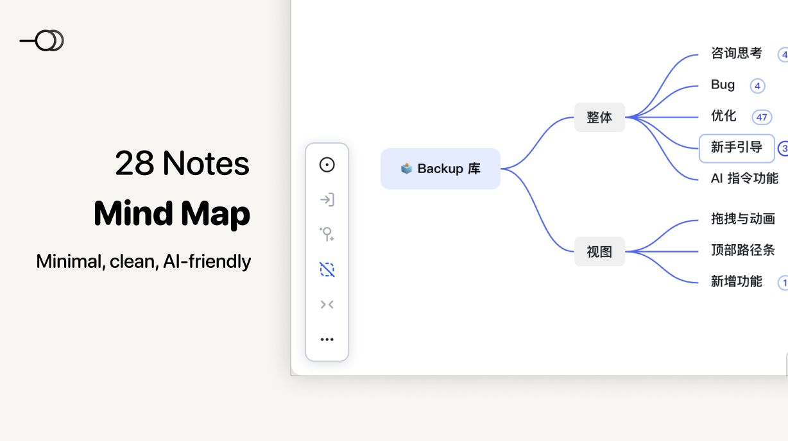
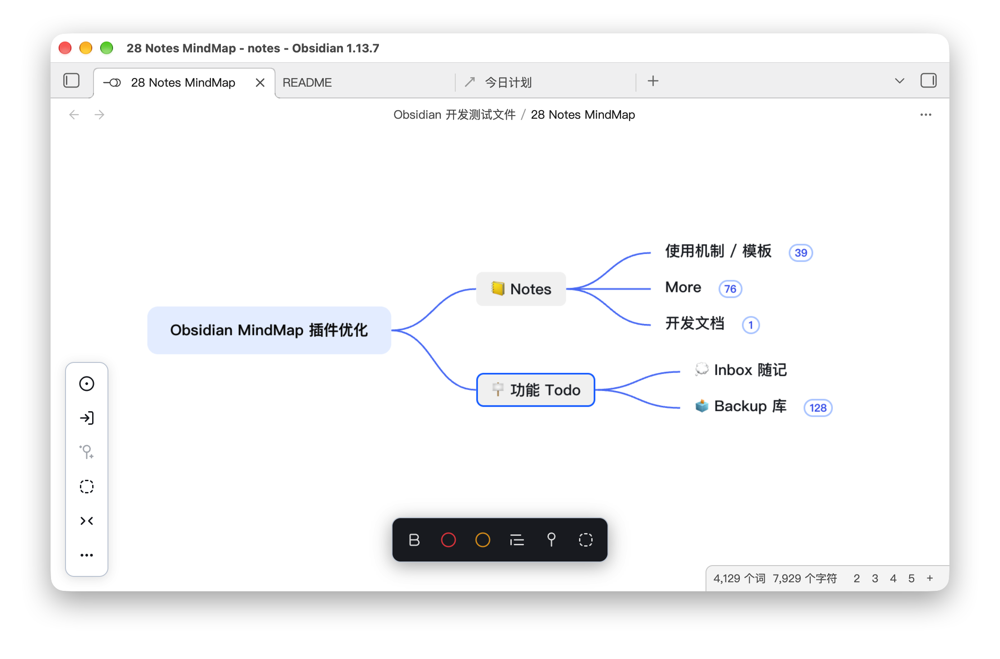
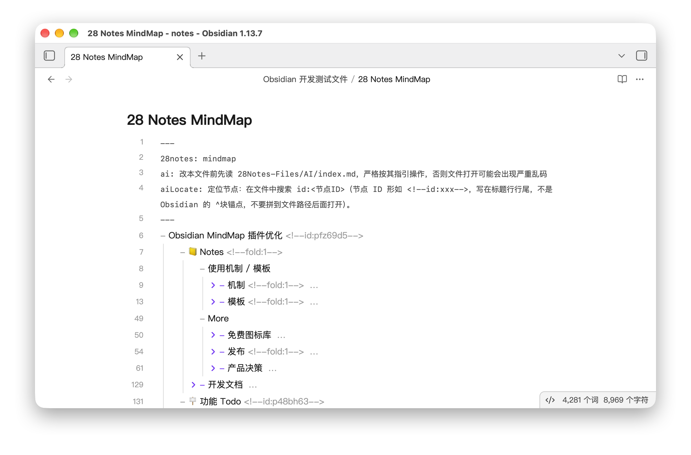
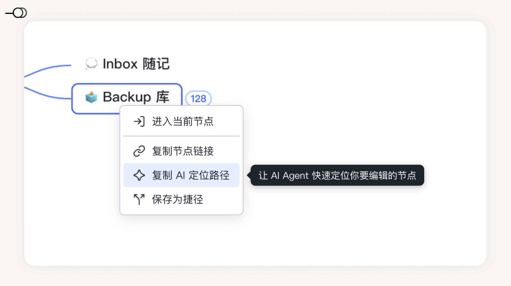
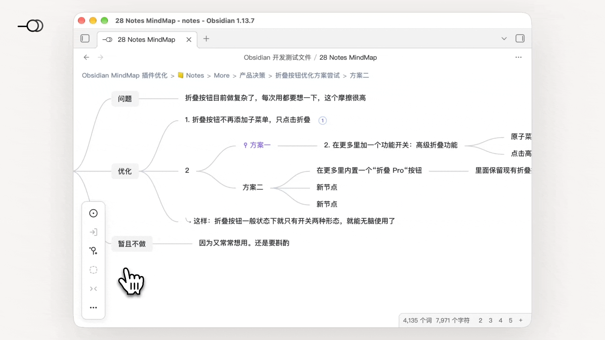
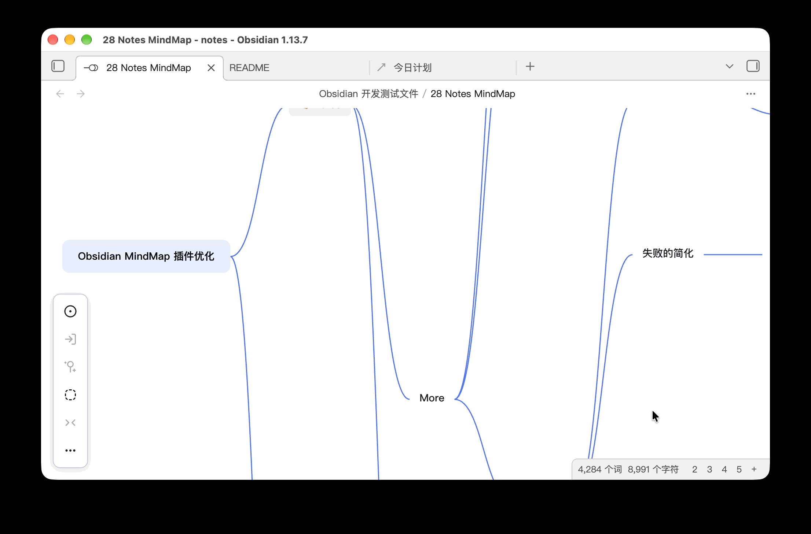
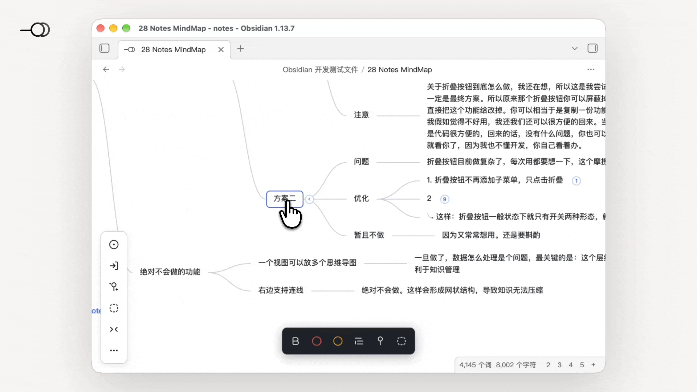
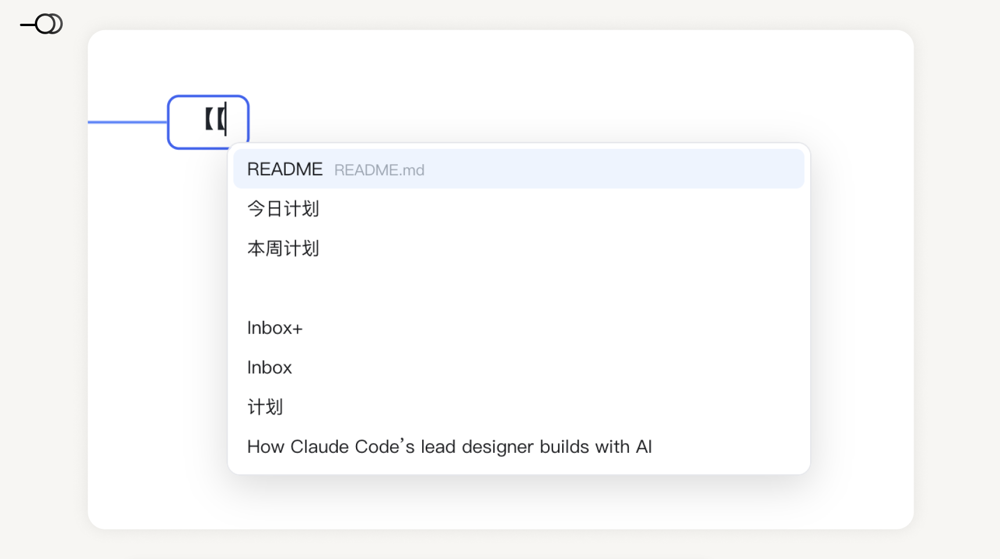

# 28 Notes MindMap

> 纯本地、Markdown 格式的思维导图，AI 可直接读写，修改。
> 设计理念源自「[28 笔记法](https://space.bilibili.com/481595180)」，可一键聚焦重点 / 隐藏非重点。
> 简洁，优雅，易用。

[简体中文](#中文文档) | [English](#english-documentation)

---

## 中文文档

## 🧤 如何安装

1. 打开 Obsidian 桌面端，进入设置 → 第三方插件 → 社区插件
2. 搜索 **28 Notes MindMap**，安装并启用

---

## 🪴 Key Features

### ❶ 简洁易用

- **简洁易用**：没有复杂的功能，繁复的界面，如同白纸一般简单；操作方式对齐常规思维导图软件，让你没有任何切换成本，轻松即可上手，思维飞扬。
- **Obsidian 编辑器**：在 Obsidian 中央编辑器直接编辑，无需另开渲染窗口，所见即所得。

*图注：28 Notes MindMap 界面*

### ❷ AI 友好

大多数思维导图软件，把数据存在私有格式里，
导致 AI Agent 工具难以直接阅读和更改。

而 28 Notes MindMap 从设计之初，就为了 AI 易用：

- **纯 Markdown 存储**：你的导图就是一个普通 `.md` 本地文件，内容是纯粹的大纲形式。关掉插件、甚至不用 Obsidian，用任何文本编辑器都能读。
- **AI 快速定位**：右键节点，即可快速复制节点路径，粘贴给 AI Agent（Claude Code、Cursor、Codex 等），它就能精确定位到你要编辑的节点，沟通非常便捷。
- **预埋 AI 指令**：你可以直接让 AI 改内容，而无需担心格式损坏。因为「格式规范」已经直接预埋在文件里了。未来预计将支持内置指令（简化版 Skill），和 AI 配合更丝滑。

*图注：28 Notes MindMap 源文件：Markdown 大纲格式*

*图注：右键复制 AI 定位路径*

### ❸ 聚焦重点

思维导图最大的痛点就是节点变多后，
一打开密密麻麻，难以使用。

28 Notes MindMap 设计了大量的创新模式，以解决这个问题：

- **当下关注 Now 功能**：你可以将当前关注的节点标记为 Now。 然后可以一键只显示当前关注节点。瞬间聚焦重点。
- **次要 Minor 功能**：你可以将次要的节点标记为 Minor。 然后一键隐藏所有次要 Minor 节点。 瞬间清净。
- **按层级折叠功能**：右下角有层级数字，点击某个数字，如数字 2，可以一键只显示一二层级。瞬间从迷失到清晰。

*图注：「一键只显示重点」功能演示*

*图注：「一键折叠至第二层级」功能演示*

除此之外，28 Notes MindMap 还支持：

- **进入节点功能**：你可以一键进入某个节点，只显示这个节点和它的子节点。外面纷纷扰扰，这里清净聚焦。
- **存为捷径功能**：你可以将进入的某个节点视图存为捷径，下次一打开直接进入。上次思维漫游到哪里，这次直接看哪里。

*图注：「进入节点」功能演示*

### ❹ 专为知识管理优化

- **Obsidian 友好**：支持 Obsidian 原生双链，超大编辑器，和 Obsidian 白板一致的快捷键和使用体验。（部分快捷键开发中）
- **知识管理友好**：极简，无繁杂。不含连接、概要等功能，利于知识压缩，侧重大批量笔记的知识管理。
- **28 笔记法思维**：设计理念源自 [28 笔记法](https://space.bilibili.com/481595180)。

*图注：支持Obsidian 双链*

---

## 🚀 快速开始

### 创建你的第一张导图

- 点击左侧功能区的“28 Notes”图标即可。
- 你也可以打开命令面板，搜索 28，用命令/快捷键，快速新建。

### 基础快捷键

| 操作 | 快捷键 |
|------|--------|
| 新建子节点 | `Tab` |
| 新建同级节点 | `Enter` |
| 进入当前节点（下钻） | `Cmd + E` |
| 标记 Now | `Cmd + N` |
| 标记 Minor | `Cmd + M` |
| 只显示 Now | `Cmd + Alt + N` |
| 隐藏/显示 Minor | `Cmd + Alt + M` |
| 折叠附近节点 | `Cmd + F` |
| 撤销 / 重做 | `Cmd + Z` / `Cmd + Shift + Z` |

>  `Cmd` 在Windows 平台为 `Ctrl`。

---

## 💰 试用与付费

### 14 天免费试用

安装后自动开始 14 天全功能试用，无任何功能限制。

### 试用结束后

我们采用特别的付费方案：

- **市面上思维导图软件存在的大多数功能：无限制使用**
- 如：无限量生成思维导图、插入图片、备注、Obsidian 双链、本地文件链接、节点链接等。

- **28 Notes 原创的创新功能：试用期结束后，需激活以使用**
- 如：Now、Minor、捷径、AI定位路径、多级折叠等。

具体如下：

| 功能 | 通用免费版 | 创新 Pro 版 |
|------|--------|--------|
| 无限制生成思维导图 | ✅ | ✅ |
| 思维导图通用编辑（增删节点、拖拽、撤销重做等） | ✅ | ✅ |
| 进入某节点/面包屑导航 | ✅ | ✅ |
| 双链/文件链接/节点链接 | ✅ | ✅ |
| 备注 | ✅ | ✅ |
| 多主题 | ✅ | ✅ |
| 历史版本快照 | ✅ | ✅ |
| 界面简化 | ✅ | ✅ |
| Now 节点 | ❌ | ✅ |
| Minor 节点 | ❌ | ✅ |
| 保存为捷径 | ❌ | ✅ |
| 复制 AI 定位路径 | ❌ | ✅ |
| 高级折叠（按层折叠） | ❌ | ✅ |

### 价格

- **早鸟价 ¥38**（~~原价 ¥76~~ → -50%）
- 买断制：一次购买，永久使用本地功能
- 支持 **3 台设备**激活
- 付款与激活方式：点此查看

> 注：买断覆盖本地全部功能。但不包含未来可能上线的在线式 AI 生成服务 / 涉及服务器的功能（此处仅为说明，此类功能大概率不会做，因为目前 AI Agent  足够简单易用）

---

## ❓ 常见问题

### 我的数据会被上传吗？

不会。28 Notes 完全本地运行，不收集数据、不调用任何外部 API。

### 和其他思维导图软件/插件有什么区别？

- **其它思维导图软件 / 插件**：私有格式，AI 无法直接编辑；功能趋同
- **28 Notes**：Markdown 格式，适合 AI Agent 操作；大量创新功能

### 支持移动端吗？

目前仅桌面端。移动端可能会做，但没有明确时间表。

### 激活码可以换电脑吗？

可以。一个码支持 3 个设备同时激活。
换电脑时在旧设备解除激活，即可在新设备上使用。

### 我可以用 AI 直接编辑导图文件吗？

可以！这正是 28 Notes 的设计目标。
你只要选中思维导图节点后，右键「复制 AI 定位路径」，给到 Agent，AI 就能精确定位和编辑。你甚至不需要告诉 AI 应该遵循什么格式，不需要加任何 Skill 外框。因为 28 Notes 已经考虑并预埋好了。

---

## 🗺️ 路线图

- [ ] 细节优化（拖拽预测、动画、上线后用户可能提交的 Bug 修复）
- [ ] AI 技能
- [ ] 更多主题（Obsidian / MindNode 风格）

---

## 📄 许可

本插件代码仅供 Obsidian 审核和社区核查，不得二次分发或用于商业转售。详见 License。

---

*28 Notes MindMap — 极简，无混乱，AI 友好*

---

## English Documentation

## 🧤 Installation

1. Open Obsidian desktop, go to Settings → Community plugins → Community plugins.
2. Search for **28 Notes MindMap**, install and enable it.

---

## 🪴 Key Features

### ❶ Simple & Easy to Use

- **Simple & easy to use**: No complex features or cluttered UI — as plain as a blank sheet of paper. The interaction aligns with conventional mind-map software, so you can pick it up with zero switching cost and let your thoughts flow.
- **Obsidian editor**: Edit directly in Obsidian's central editor, no separate render window needed — what you see is what you get.

*Caption: 28 Notes MindMap interface*

### ❷ AI-Friendly

Most mind-map software stores data in proprietary formats, making it hard for AI Agent tools to read or modify directly.

28 Notes MindMap was designed from the ground up to be AI-friendly:

- **Pure Markdown storage**: Your map is just a plain local `.md` file in outline form. Close the plugin, or even skip Obsidian entirely — any text editor can read it.
- **Fast AI locating**: Right-click a node to copy its path, paste it to an AI Agent (Claude Code, Cursor, Codex, etc.), and it can pinpoint exactly the node you want to edit — communication is effortless.
- **Embedded AI instructions**: You can ask the AI to edit content directly without worrying about breaking the format, because the "format spec" is already embedded in the file. Built-in instructions (a simplified Skill) are planned to make AI collaboration even smoother.

*Caption: 28 Notes MindMap source file — Markdown outline format*

*Caption: Right-click to copy the AI location path*

### ❸ Focus on What Matters

The biggest pain point of mind maps is that once nodes grow, opening one feels overwhelming and unusable.

28 Notes MindMap introduces many innovative modes to solve this:

- **Now focus**: Mark the node you're currently focused on as Now, then show only that node with one click — instantly zero in on what matters.
- **Minor**: Mark secondary nodes as Minor, then hide all Minor nodes with one click — instantly declutter.
- **Level folding**: Level numbers sit at the bottom-right; click a number (e.g. 2) to show only levels 1–2 — instantly go from lost to clear.

*Caption: "Show only what matters" demo*

*Caption: "Fold to level 2" demo*

Additionally, 28 Notes MindMap also supports:

- **Enter node**: Drill into a node with one click, showing only it and its children. Peace and focus amid the noise.
- **Save as shortcut**: Save a drilled-in node view as a shortcut and reopen it directly next time — pick up exactly where your mind left off.

*Caption: "Enter node" demo*

### ❹ Optimized for Knowledge Management

- **Obsidian-friendly**: Supports Obsidian native bidirectional links, the large editor, and the same shortcuts / experience as Obsidian Canvas (some shortcuts in development).
- **Knowledge-management-friendly**: Minimal, no clutter. No connections or summaries — aids knowledge compression, suited to managing large volumes of notes.
- **28 Notes Method thinking**: Design philosophy from [28 Notes Method](https://space.bilibili.com/481595180).

*Caption: Supports Obsidian bidirectional links*

---

## 🚀 Quick Start

### Create your first map

- Click the "28 Notes" icon in the left ribbon.
- Or open the command palette, search "28", and use the command / hotkey to create one quickly.

### Basic shortcuts

| Action | Shortcut |
|--------|----------|
| Create child node | `Tab` |
| Create sibling node | `Enter` |
| Enter current node (drill down) | `Cmd + E` |
| Mark Now | `Cmd + N` |
| Mark Minor | `Cmd + M` |
| Show only Now | `Cmd + Alt + N` |
| Hide / show Minor | `Cmd + Alt + M` |
| Fold nearby nodes | `Cmd + F` |
| Undo / Redo | `Cmd + Z` / `Cmd + Shift + Z` |

>  `Cmd` is `Ctrl` on Windows.

---

## 💰 Trial & Pricing

### 14-day free trial

A full-feature 14-day trial starts automatically after install, with no limitations.

### After the trial

We use a special pricing model:

- **Most features found in mainstream mind-map software: unlimited**
  - e.g. unlimited map generation, images, notes, Obsidian links, local file links, node links, etc.
- **28 Notes' original innovations: require activation after the trial**
  - e.g. Now, Minor, shortcuts, AI location path, multi-level folding, etc.

Details:

| Feature | Free | Pro |
|---------|------|-----|
| Unlimited map generation | ✅ | ✅ |
| General editing (add/delete nodes, drag, undo/redo…) | ✅ | ✅ |
| Enter node / breadcrumb nav | ✅ | ✅ |
| Bidirectional / file / node links | ✅ | ✅ |
| Notes | ✅ | ✅ |
| Multiple themes | ✅ | ✅ |
| History snapshots | ✅ | ✅ |
| UI simplification | ✅ | ✅ |
| Now node | ❌ | ✅ |
| Minor node | ❌ | ✅ |
| Save as shortcut | ❌ | ✅ |
| Copy AI location path | ❌ | ✅ |
| Advanced folding (by level) | ❌ | ✅ |

### Pricing

- **Early-bird price ¥38** (~~original ¥76~~ → -50%)
- One-time purchase: buy once, use local features forever
- Supports activation on **3 devices**
- Payment & activation: see here

> Note: The one-time purchase covers all local features, but excludes possible future online AI-generation services / server-dependent features (noted for clarity only; such features are unlikely, as current AI Agents are simple enough).

---

## ❓ FAQ

### Will my data be uploaded?

No. 28 Notes runs fully locally — no data collection, no external API calls.

### How is it different from other mind-map software / plugins?

- **Others**: proprietary format, AI can't edit directly; features converge
- **28 Notes**: Markdown format, suited for AI Agents; many innovations

### Mobile support?

Desktop only for now. Mobile may come, but no fixed timeline.

### Can the activation code move to another computer?

Yes. One code activates up to 3 devices simultaneously. Deactivate on the old device to use it on a new one.

### Can I let AI edit the map file directly?

Yes! That's exactly the design goal. Select a node, right-click "Copy AI location path", hand it to the Agent, and it can pinpoint and edit precisely. You don't even need to tell the AI what format to follow or add any Skill wrapper — 28 Notes has it considered and embedded already.

---

## 🗺️ Roadmap

- [ ] Detail polish (drag prediction, animation, post-launch bug fixes)
- [ ] AI skills
- [ ] More themes (Obsidian / MindNode style)

---

## 📄 License

The plugin code is for Obsidian review and community verification only; redistribution or commercial resale is prohibited. See License for details.

---

*28 Notes MindMap — Minimal, no clutter, AI-friendly*
